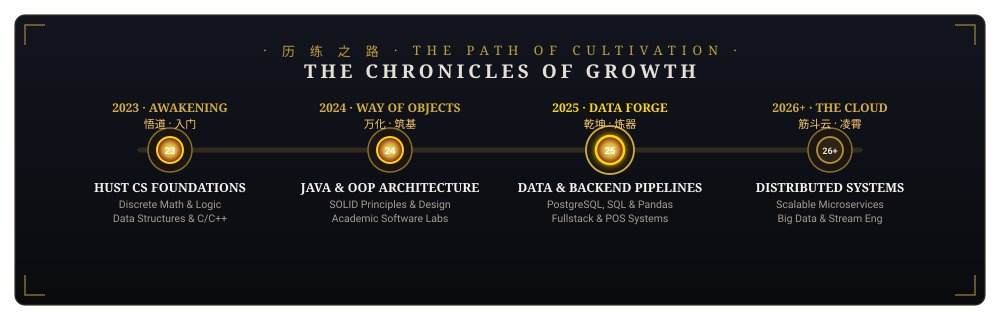
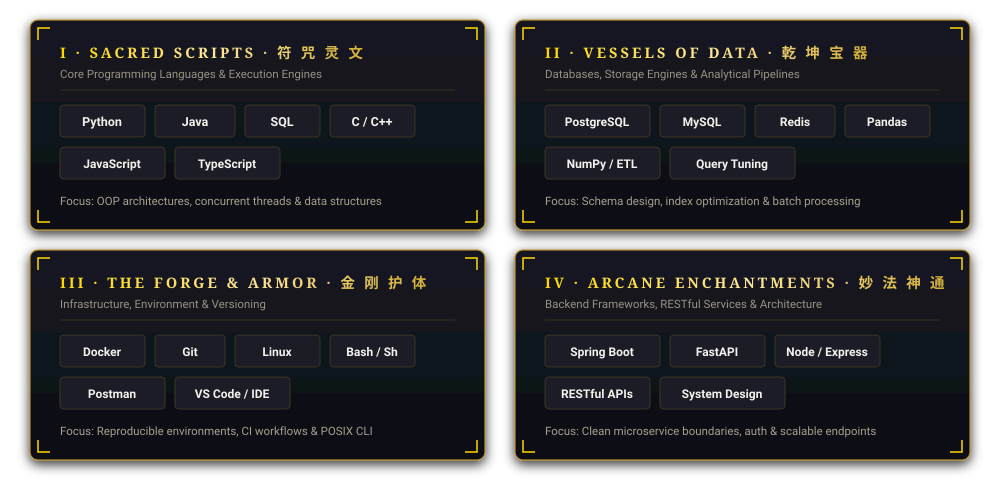
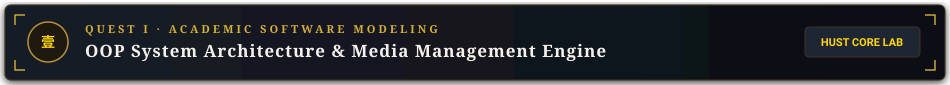
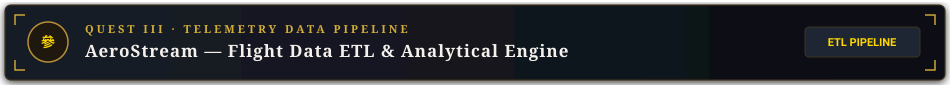
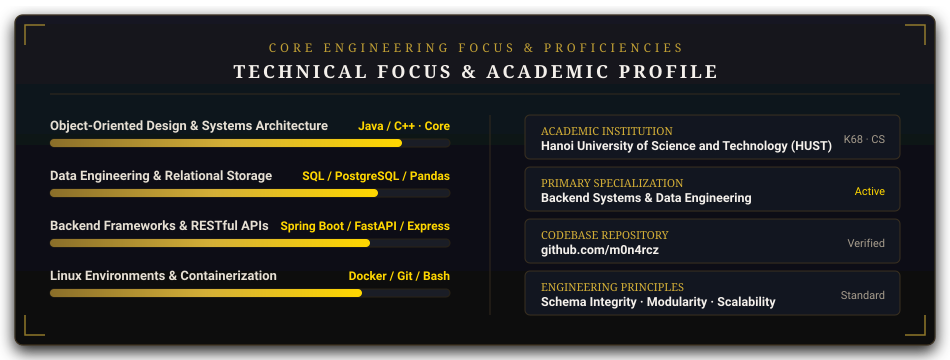

  

  

 

<!-- ========================================== -->
<!--       CHAPTER 壹 · THE TRAVELER            -->
<!-- ========================================== -->

  CHAPTER 壹
  <h2 style="color: #ffd700; font-family: 'Cinzel', serif; letter-spacing: 5px; margin-top: 4px; margin-bottom: 6px;">THE TRAVELER</h2>
  

    Undergraduate in Computer Science · Hanoi University of Science and Technology
  

<table align="center" width="100%" style="background-color: #0d1017; border: 1px solid #3a3020; border-radius: 8px; box-shadow: 0 4px 16px rgba(0,0,0,0.6);">
  <tr>
    <td style="padding: 24px; color: #e6dfd3;">
      

        Hi, I&apos;m <strong>Nguyễn Nhật Anh</strong> (<a href="https://github.com/m0n4rcz" style="color: #ffd700; text-decoration: none;"><strong>@m0n4rcz</strong></a>), an undergraduate studying Computer Science at the <strong>Hanoi University of Science and Technology (HUST)</strong>.
      

      

        My work centers on backend systems, data engineering, and software architecture. I bridge foundational computer science principles with pragmatic software design&mdash;building maintainable server-side applications, optimized relational database schemas, and structured data processing pipelines.
      

       
      

        <table width="94%" style="background-color: #141822; border: 1px solid #2d2618; border-radius: 6px;">
          <tr>
            <td width="33%" style="padding: 14px; text-align: center; border-right: 1px solid #2d2618;">
              DATA ENGINEERING 
              PostgreSQL · Schemas · ETL Pipelines
            </td>
            <td width="33%" style="padding: 14px; text-align: center; border-right: 1px solid #2d2618;">
              BACKEND SYSTEMS 
              Java · Spring Boot · Node · REST APIs
            </td>
            <td width="34%" style="padding: 14px; text-align: center;">
              ARCHITECTURE &amp; TOOLS 
              Clean OOP · Docker · Linux / POSIX
            </td>
          </tr>
        </table>
      

    </td>
  </tr>
</table>

  

  

 

<!-- ========================================== -->
<!--          CHAPTER 貳 · THE PATH             -->
<!-- ========================================== -->

  CHAPTER 貳
  <h2 style="color: #ffd700; font-family: 'Cinzel', serif; letter-spacing: 5px; margin-top: 4px; margin-bottom: 6px;">THE PATH</h2>
  

    Academic progression, technical milestones, and architectural focus
  

  

  

    <strong>[ VIEW DETAILED TIMELINE BREAKDOWN ]</strong>
  

   
  

    <ul>
      <li><strong style="color: #ffd700;">2023 · HUST Computer Science Core</strong>: Admitted to <strong>HUST</strong> (Class K68). Mastered core algorithms, discrete mathematics, memory models, and procedural programming in C/C++.</li>
      <li><strong style="color: #ffd700;">2024 · Systems &amp; Object-Oriented Design</strong>: Advanced Java development covering SOLID principles, design patterns, encapsulation, polymorphism, and modular software engineering laboratories.</li>
      <li><strong style="color: #ffd700;">2025 · Data Engineering &amp; Backend Services</strong>: Relational schema normalization in PostgreSQL, indexing strategies, analytical batch data processing with Pandas, and fullstack retail POS development.</li>
      <li><strong style="color: #ffd700;">2026+ · Distributed Systems &amp; Scalability</strong>: Advancing into high-throughput backend services, streaming data pipelines, message queues, and cloud deployment architectures.</li>
    </ul>
  

  

  

 

<!-- ========================================== -->
<!--        CHAPTER 參 · THE ARSENAL            -->
<!-- ========================================== -->

  CHAPTER 參
  <h2 style="color: #ffd700; font-family: 'Cinzel', serif; letter-spacing: 5px; margin-top: 4px; margin-bottom: 6px;">THE ARSENAL</h2>
  

    Core languages, database technologies, developer tooling, and backend frameworks
  

  

  

  

 

<!-- ========================================== -->
<!--         CHAPTER 肆 · THE QUESTS            -->
<!-- ========================================== -->

  CHAPTER 肆
  <h2 style="color: #ffd700; font-family: 'Cinzel', serif; letter-spacing: 5px; margin-top: 4px; margin-bottom: 6px;">THE QUESTS</h2>
  

    Featured systems, architectural codebases, and data pipelines
  

 

<!-- Quest 1 -->

  

    
  

  <table align="center" width="100%" style="background-color: #0e121a; border: 1px solid #3a3020; border-top: none; border-bottom-left-radius: 8px; border-bottom-right-radius: 8px;">
    <tr>
      <td style="padding: 18px 24px;">
        

          An academic laboratory software engineering project at HUST demonstrating modular object-oriented architecture. Implemented extensible media cataloging, polymorphic sorting, strict encapsulation, and automated test coverage adhering to core software engineering principles.
        

        <table width="100%">
          <tr>
            <td align="left">
              Java
              OOP Principles
              Design Patterns
              HUST K68
            </td>
            <td align="right">
              
            </td>
          </tr>
        </table>
      </td>
    </tr>
  </table>

<!-- Quest 2 -->

  

    
  

  <table align="center" width="100%" style="background-color: #0e121a; border: 1px solid #3a3020; border-top: none; border-bottom-left-radius: 8px; border-bottom-right-radius: 8px;">
    <tr>
      <td style="padding: 18px 24px;">
        

          A point-of-sale platform developed for retail transaction throughput and inventory control. Designed with normalized relational schemas, ACID-compliant checkout operations, cashier workflows, and modular RESTful API endpoints.
        

        <table width="100%">
          <tr>
            <td align="left">
              React
              Node.js / Express
              PostgreSQL
              REST APIs
            </td>
            <td align="right">
              
            </td>
          </tr>
        </table>
      </td>
    </tr>
  </table>

<!-- Quest 3 -->

  

    
  

  <table align="center" width="100%" style="background-color: #0e121a; border: 1px solid #3a3020; border-top: none; border-bottom-left-radius: 8px; border-bottom-right-radius: 8px;">
    <tr>
      <td style="padding: 18px 24px;">
        

          An automated ETL data pipeline extracting, transforming, and loading flight telemetry and delay records into indexed PostgreSQL tables for spatial and temporal analysis. Optimized with query indexing and automated data cleaning routines.
        

        <table width="100%">
          <tr>
            <td align="left">
              Python
              Pandas / NumPy
              PostgreSQL
              Docker
            </td>
            <td align="right">
              
            </td>
          </tr>
        </table>
      </td>
    </tr>
  </table>

 

  

 

<!-- ========================================== -->
<!--       CHAPTER 伍 · THE CHRONICLE           -->
<!-- ========================================== -->

  CHAPTER 伍
  <h2 style="color: #ffd700; font-family: 'Cinzel', serif; letter-spacing: 5px; margin-top: 4px; margin-bottom: 6px;">THE CHRONICLE</h2>
  

    Core engineering proficiencies, academic attributes, and commit consistency
  

  

  

  

  

 

<!-- ========================================== -->
<!--       CHAPTER 終 · THE FINAL GATE          -->
<!-- ========================================== -->

  CHAPTER 終
  <h2 style="color: #ffd700; font-family: 'Cinzel', serif; letter-spacing: 5px; margin-top: 4px; margin-bottom: 6px;">THE FINAL GATE</h2>
  

    Connect, collaborate, and discuss engineering systems
  

  

  <table width="80%" style="background-color: #0e1118; border: 1px solid #3a3020; border-radius: 8px;">
    <tr>
      <td width="33%" align="center" style="padding: 16px; border-right: 1px solid #2d2618;">
        GITHUB 
        <a href="https://github.com/m0n4rcz" style="color: #f4f0eb; text-decoration: none; font-size: 14px; font-weight: bold;">
          @m0n4rcz
        </a> 
        Developer Profile
      </td>
      <td width="33%" align="center" style="padding: 16px; border-right: 1px solid #2d2618;">
        EMAIL 
        <a href="mailto:nn08012005@gmail.com" style="color: #f4f0eb; text-decoration: none; font-size: 14px; font-weight: bold;">
          Direct Email
        </a> 
        nn08012005@gmail.com
      </td>
      <td width="34%" align="center" style="padding: 16px;">
        UNIVERSITY 
        <a href="https://en.wikipedia.org/wiki/Hanoi_University_of_Science_and_Technology" style="color: #f4f0eb; text-decoration: none; font-size: 14px; font-weight: bold;">
          HUST Campus
        </a> 
        Hanoi, Vietnam
      </td>
    </tr>
  </table>

  

  
    
  
    &ldquo;Dedicated to building resilient backend architectures, clean code, and scalable data pipelines.&rdquo;
  
    
  
    NGUYỄN NHẬT ANH · HANOI UNIVERSITY OF SCIENCE AND TECHNOLOGY · CLASS OF 2023–2027
  

